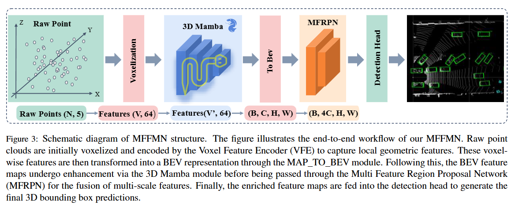
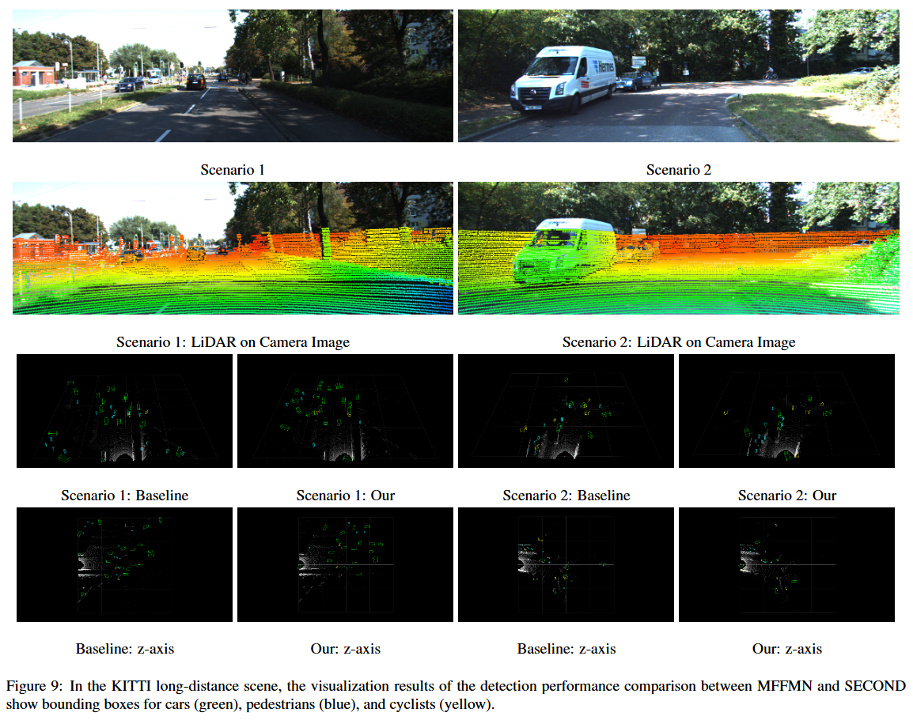

# MFFMN: Multi-Feature Fusion Mamba Enhancement Network for LiDAR-based 3D Object DetectionHighlights

---

This is the official implementation of ***MFFMN*** , a simple and highly efficient point-based detector for 3D LiDAR point clouds. For more details, please refer to:

**MFFMN: Multi-Feature Fusion Mamba Enhancement Network for LiDAR-based 3D Object DetectionHighlights**

Weiwei Kong, Yusheng Du





## 1. Environment

- Linux (tested on Ubuntu 20.04)
- Python 3.8
- PyTorch 2.0.0
- CUDA 11.8

## 2. Set the Environment

```shell
pip install -r requirement.txt
python setup.py develop
```

## 3. Data Preparation

- Prepare [KITTI](http://www.cvlibs.net/datasets/kitti/eval_object.php?obj_benchmark=3d) dataset and [road planes](https://drive.google.com/file/d/1d5mq0RXRnvHPVeKx6Q612z0YRO1t2wAp/view?usp=sharing).

- ```
  ├── data
  │   ├── kitti
  │   │   │── ImageSets
  │   │   │── training
  │   │   │   ├──calib & velodyne & label_2 & image_2 & (optional: planes)
  │   │   │── testing
  │   │   │   ├──calib & velodyne & image_2
  ```

## 4. Train

- Train with a single GPU:

```
python train.py --cfg_file ${CONFIG_FILE}
```

- Train with multiple GPUs

```
bash train.sh
```


## 5. Test

- Test with a single GPU:

```
python test.py --cfg_file ${CONFIG_FILE} --ckpt ${CKPT}
```

- Test with multiple GPUs

```
bash test.sh
```


# MFFMN
MFFMN: Multi-Feature Fusion Mamba Enhancement Network for LiDAR-based 3D Object Detection
